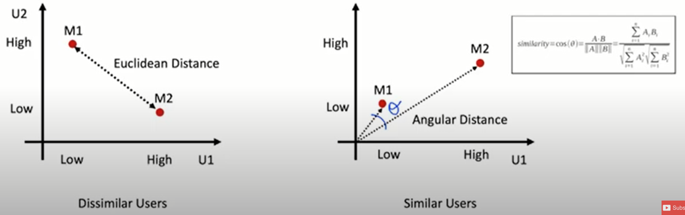

# Model/data format investigation - findings
## Review of some background info

### Two basic CF approaches
There are two basic approaches to collaborative filtering, user-based and item-based. 

(1) user-based recommends items to a user through finding similar users (from selected criteria) and recommending new items that the similar users liked
  - ex: Both Nick and Brock really liked Moneyball and The Big Short but they both really didn't like Cats (with James Corden). Thus, based on these preferences we can say that Nick and Brock are similar users. Brock also really liked the Steve Jobs movie he just watched with Kev, so the system recommends Steve Jobs to Nick.
 
(2) item-based recommends items to a user based on similar items.
  - ex: Ali really liked reading Shoedog (Phil Knight) and so did Kevin, but Nick thought it was just OK. Kevin also liked The Ride of a Lifetime (Bob Iger) and once again, Nick thought it was just OK. Based on this criteria, the system assumes these two books are pretty similar, we it recommends The Ride of a Lifetime to Ali.
  
### Two overarching techniques
There are also two overarching techniques for navigating data, memomory-based and model-based.

(1) memory-based involves finding similar users based on some distance metric
  - ex: cosine similarity (takes dot product of two vectors to find distance measured as angle between)
  
  
  
(2) model-based applies machine learning models to user's ratings datasets to predict how likely it is that a user would like anew item
  - ex: matrix factorization 
  
## CF Cos Similarity - Notebook
### Overview
Followed this YouTube tutorial to get started learning how to produce recommendations with the cosine similarity approach: https://www.youtube.com/watch?v=3ecNC-So0r4&t=368s

Process of producing recommendations with user ratings data and cosine similarity seems pretty straightforward. Very minimal Python code is required. The simplest approach would be to simply collect user ratings on each article and store into a user/article ratings database. Then use cosine similarity to compute either similar users or similar articles (user-based vs item-based). 

In practice, item-based works better than user-based. Generally, there are a lot more users in a system than the number of items. Also, user preferences are dynamic (they can change as time passes) whereas in item-based, the items stay the same.

### Methodology
1. required libraries are: pandas, scipy, sklearn
2. imported very simple table with five users and their ratings of 3 action movies and 3 romantic movies
3. filled NaN cells with '0'
4. normalized ratings so that the ratings across each row (for each user) has a mean of 0 and a range of 1
5. computed cosine similarity between items and store in item similarity dataframe
6. made recommendation function which takes movie name and the user rating as parameters. Finds the item similarity score in the similary dataframe and amplifies by user_rating - 2.5 which is (max rating/2). This corrects for poor ratings. 
7. returns sorted list of most similar movies (items)
8. process steps were similarly repeated for user-based, only difference is cosine similarity computed between users

### Next steps
- apply memory-based CF techniques to a real world dataset
- learn model based approach

  
