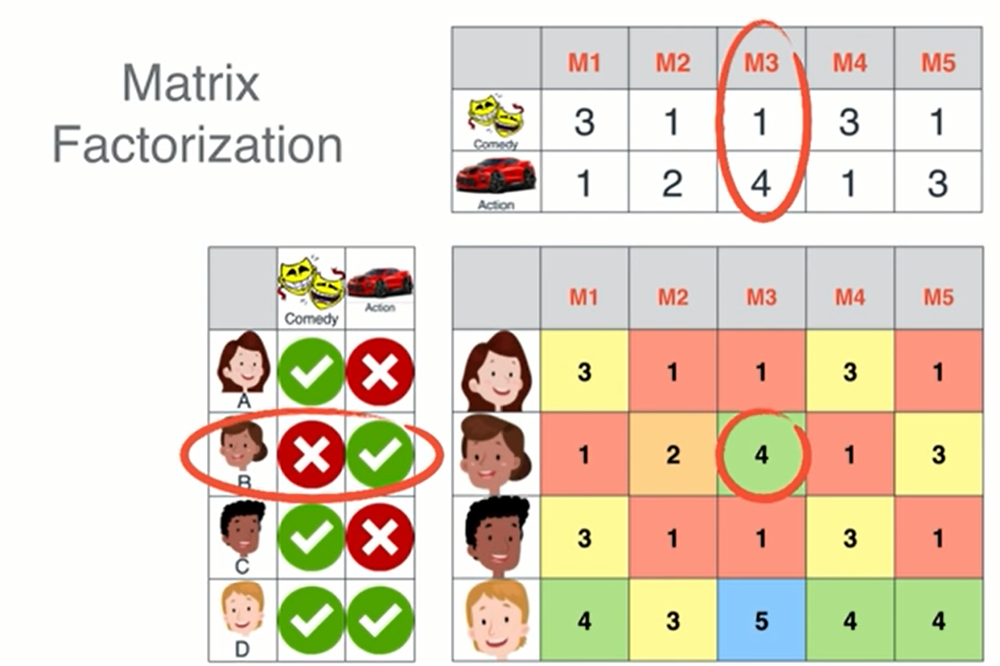

# Findings for model based CF

## exploration of matrix factorization in a recommender engine
images and knowledge taken from wathing this vid: https://www.youtube.com/watch?v=ZspR5PZemcs

#### find dependencies in the matrix
- rows 1 and 3 are exactly the same, so those two users have the same preferences
- column 1 and column 4 are exactly the same, so movie 1 and movie 4 are similar movies and have similar ratings (Mall Cop - Paul Blart & Observe and Report - Seth Rogen)
- rows 2 and 3 add to row 4, so user 4 enjoys both the preferences of user 2 and user 3. (ex: user 2 likes action movies, user 3 likes comedy movies, user 4 likes comedy and action movies)
- column 5 is the average of columns 2 and 3. m2 could be twister (tornado movie), m3 could be jaws, m5 would both - sharknado. if you hate sharks and hate tornados, then you'll hate sharknado (row 1). If you like sharks and you like tornados, then you'll like sharnado (row 4). If you like sharks and don't really like tornados, then you'll only somewhat like sharnado.

#### we use matrix factorization to figure out these dependencies that allow us to predict ratings

factorization, as we learned in highschool math, is determining the small parts that make up a big part.

Matrix factorization is the same thing. We have a big matrix on the right, and we are interested in the parts that make it up. 

to determine this, we use features

#### features in a movie can be anything
- comedy, action, is there a big boat in it, is Meryl Streep in it, is it a drama, does it have a dog in it
- dot product is used to determine the rating that is given based on the movies features and the users preferences. Used to figure out the entire table.

#### how to find the right factorization? hint: ML
- define matrix factorization function which takes the original matrix (user-item ratings table) as an input
- system 'guesses' matrix factors and compares resultant predicted matrix to original matrix
- define an error function to see how far off the predicted matrix is
- use gradient descent to reduce the error function 
- and voila, you have a replicated user-item ratings matrix with predictions for the original empty cells

## Application of matrix factorization - Matrix Factorization CF notebook

#### overview
Successfully implemented a matrix factorization algorithm. Built with a simplified gradient descent algorithm and a mean squared error function. Initial testing on a small dataset produced effective results. Results from testing on a real dataset are still pending (taking awhile). 

#### methodology
1. first import data 
2. define matrix factorization function which takes the following arguements
  - R = original user-item ratings matrix holding true values
  - P, Q = two matrix factors of R used in gradient descent
  - K = hyperparameter representing number of features, as K increases, the model has more chances to get closer to real data, but time will increase as well
  - steps = number of steps in training loop
  - alpha, beta = parameters for gradient descent
3. transpose Q so that it has the same dimensions as P
4. outermost for loop begins at 0 and ends at the value stored in 'steps', this is the main training loop
5. next 2 for loops ('i' and 'j') loop through row number and column number, respectively. Used to access each cell in matrix
6. if statement to check value in cell > 0, this indicates that there exists a valid rating
7. variable eij stores difference between the true value in original matrix and the predicted value - which is the dot product of the two matrix factors
8. perform updating with a simplified gradient descent alg
9. intiate error variable to store mean squared error and define error function after
10. set threshold for error function to break from for loop
11. return both matrix factors, P and Q

### results
pending

### implications for our project 

